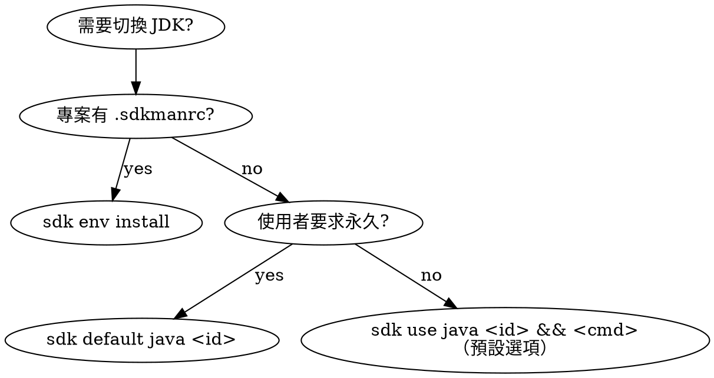

# SDKMAN 切換 JDK

## 概覽

使用這個技能以安全且可預期的方式透過 SDKMAN 切換 Java 版本。
優先選擇影響範圍最小的變更：暫時切換用 `sdk use java`，只有在使用者明確要求永久預設時才用 `sdk default java`。

## When to Use

- `java -version` 顯示的版本與專案要求不符
- 執行 `mvn test` / `gradle build` 失敗，錯誤含 "unsupported class file version"、"invalid source release"、"source/target compatibility"
- 專案有 `.sdkmanrc` 或 `.java-version` 但當前 Java 版本未匹配
- 使用者明確要求切換 JDK 版本

**不要用於**：

- 系統沒有安裝 SDKMAN（改為引導安裝）
- 問題不是 JDK 版本相關（如 Maven/Gradle 設定錯誤、依賴缺失）
- 只需查看版本不需要切換（直接跑 `java -version`）

## Quick Reference

所有指令前都要加 SDKMAN 初始化前綴（見下方「非互動式 Shell 初始化」）。

| 動作 | 指令 |
|------|------|
| 檢查實際使用版本 | `java -version 2>&1` |
| 確認 java 路徑 | `which java` |
| 列出已安裝版本 | `ls -1 "${SDKMAN_CANDIDATES_DIR:-${SDKMAN_DIR:-$HOME/.sdkman}/candidates}/java" \| grep -v '^current$'` |
| 從主版本號找 identifier | `ls ... \| grep '^21\.' \| head -1` |
| 暫時切換 + 執行 | `sdk use java <id> && <cmd>` |
| 永久切換 | `sdk default java <id>` |
| 專案切換（安裝 + 切換） | `sdk env install` |
| 安裝新版本 | `SDKMAN_AUTO_ANSWER=true sdk install java <id>` |

## 重要：非互動式 Shell 初始化

在非互動式命令執行環境中，SDKMAN 預設不會被載入。
**每個 bash 命令都必須先 source SDKMAN 初始化腳本**：

```bash
source "${SDKMAN_DIR:-$HOME/.sdkman}/bin/sdkman-init.sh" && <your command>
```

後續所有範例皆省略此前綴，但實際執行時**一律需要加上**。

**注意**：SDKMAN 的 `sdk` 指令會輸出 ANSI 色碼（如 `\033[1;32m`），且無法透過環境變數關閉（`sdk()` 函數每次調用都會重新載入 config 覆蓋設定）。這些色碼不影響功能，但**不要 parse `sdk` 指令的輸出文字來判斷版本**——一律用 `java -version` 和 `which java` 驗證。

## 重要：`sdk use` 跨命令失效

`sdk use java <identifier>` 只影響當前 shell session。每次命令執行都可能開新 shell，導致切換失效。

**解法**：在需要特定 JDK 的命令前，一律串接 source 與 `sdk use`：

```bash
source "${SDKMAN_DIR:-$HOME/.sdkman}/bin/sdkman-init.sh" && sdk use java <identifier> && <actual command>
```

範例（用 JDK 21 跑 Maven 測試）：

```bash
source "${SDKMAN_DIR:-$HOME/.sdkman}/bin/sdkman-init.sh" && sdk use java 21.0.9-tem && mvn test
```

若使用者同意永久切換，則改用 `sdk default java <identifier>`，後續新 shell 會自動使用該版本。

## 切換範圍決策



## 工作流程

1. 偵測專案所需 JDK 版本（不變更環境）。
2. 檢查 SDKMAN 與目前 Java 狀態。
3. 先列出本機已安裝 JDK，必要時再安裝。
4. 依需求套用切換範圍：暫時、預設或專案層級。
5. 驗證結果並提供回復命令。

## 偵測專案所需 JDK 版本

依以下優先順序檢查：

1. **`.sdkmanrc`** — 讀取 `java=` 值（可能是完整 identifier 如 `21.0.9-tem`，也可能只有主版本號）
2. **`.java-version`** — 讀取檔案內容取得版本號
3. **`pom.xml`** — 查看 `<maven.compiler.source>`、`<maven.compiler.target>` 或 `<java.version>` property
4. **`build.gradle` / `build.gradle.kts`** — 查看 `sourceCompatibility`、`targetCompatibility` 或 `jvmToolchain`
5. **使用者明確指定**

讀取 `.sdkmanrc` 中 Java 識別碼：

```bash
grep '^java=' .sdkmanrc | head -1 | cut -d= -f2-
```

若取得的是**完整 identifier**（如 `21.0.9-tem`），直接使用。
若取得的是**主版本號**（如 `21`），需從已安裝清單比對完整 identifier：

```bash
ls -1 "${SDKMAN_CANDIDATES_DIR:-${SDKMAN_DIR:-$HOME/.sdkman}/candidates}/java" | grep -v '^current$' | grep "^21\." | head -1
```

若本機沒有匹配的版本，先安裝再使用（見下方「找出或安裝目標 JDK」）。

## 檢查環境

```bash
sdk version && java -version 2>&1 && which java
```

- 若 `source` 失敗或 `sdk` 不可用，先停止並詢問是否要安裝 SDKMAN。
- **`java -version` 和 `which java` 是真實版本依據**。
- 注意：`sdk current java` 只顯示 default 版本，不反映 `sdk use` 的效果，**不要用它來驗證切換結果**。

## 找出或安裝目標 JDK

優先列出本機已安裝的 JDK（低輸出、節省 context）：

```bash
ls -1 "${SDKMAN_CANDIDATES_DIR:-${SDKMAN_DIR:-$HOME/.sdkman}/candidates}/java" | grep -v '^current$'
```

若本機沒有目標版本，再列出可用的遠端候選版本：

```bash
sdk list java
```

安裝目標版本（已安裝的版本會自動跳過，不會報錯）：

```bash
SDKMAN_AUTO_ANSWER=true sdk install java <identifier>
```

`SDKMAN_AUTO_ANSWER=true` 防止非互動式 shell 卡在 "Set as default?" 提示。
識別碼格式範例：`21.0.9-tem`。

**簡化策略**：因為 `sdk install` 對已安裝版本無害（輸出 "already installed" 並正常結束），可以無條件先 install 再 use，不需要先檢查是否已安裝。

## 套用要求的範圍

### 暫時（僅目前 shell）— 預設選項

當使用者要求測試或暫時切換時使用。**注意搭配實際命令串接**：

```bash
sdk use java <identifier> && <actual command>
```

效果會在目前 shell 結束後失效。

### 永久預設（新 shell）

只有在使用者明確要求全域或預設 JDK 時才使用：

```bash
sdk default java <identifier>
```

效果會套用到所有新開的 shell。

### 專案層級（`.sdkmanrc`）

在專案根目錄執行（僅 `.sdkmanrc` 不存在時）：

```bash
sdk use java <identifier> && sdk env init
```

這會將目前版本寫入 `.sdkmanrc`。

若 `.sdkmanrc` **已存在**，不要執行 `sdk env init`（會報錯），改為只更新 `java=` 行並保留其他設定：

```bash
cp .sdkmanrc .sdkmanrc.bak
# 只更新 java= 行，保留 .sdkmanrc 中的其他候選設定（如 maven=、gradle= 等）
awk -v id="<identifier>" 'BEGIN{updated=0} /^java=/{print "java=" id; updated=1; next} {print} END{if(!updated) print "java=" id}' .sdkmanrc > .sdkmanrc.tmp && mv .sdkmanrc.tmp .sdkmanrc
```

之後可用以下命令安裝（若缺少）並啟用專案版本：

```bash
sdk env install
```

注意 `sdk env` 和 `sdk env install` 的區別：
- `sdk env` → 切換到 `.sdkmanrc` 指定的版本，**若版本未安裝只會警告**
- `sdk env install` → **自動安裝**缺少的版本並切換（推薦使用）

## 驗證與回復

驗證（不要用 `sdk current java`，它只顯示 default 不反映 `sdk use`）：

```bash
java -version 2>&1 && which java
```

預期 `which java` 應指向 `$HOME/.sdkman/candidates/java/<identifier>/bin/java`。

依切換範圍回復：

```bash
# temporary — 下次命令不串接 sdk use 即可恢復 default

# default
sdk default java <previous-identifier>

# project-level（若有備份）
[ -f .sdkmanrc.bak ] && mv .sdkmanrc.bak .sdkmanrc
sdk env install
```

## 備援：直接設定 JAVA_HOME

若 `sdk use` 無法生效（例如某些工具不走 PATH 而直接讀 `JAVA_HOME`），可直接導出：

```bash
export JAVA_HOME="${SDKMAN_DIR:-$HOME/.sdkman}/candidates/java/<identifier>"
export PATH="$JAVA_HOME/bin:$PATH"
```

或使用 SDKMAN 的 `current` symlink（指向 default 版本）：

```bash
export JAVA_HOME="$HOME/.sdkman/candidates/java/current"
export PATH="$JAVA_HOME/bin:$PATH"
```

## 常見錯誤處理

| 錯誤訊息 | 原因 | 解法 |
| --- | --- | --- |
| `sdk: command not found` | SDKMAN 未初始化 | 確認 `source` 初始化腳本有在命令前執行 |
| `Stop! <id> is not available.` | 版本識別碼錯誤 | 用 `sdk list java` 重新確認正確的識別碼 |
| `java -version` 與預期不符 | `PATH` 中有其他 Java（如 `/usr/bin/java`） | 檢查 `which java` 確認路徑，移除或調整衝突的 PATH 項目 |
| `sdk env init` 失敗 | `.sdkmanrc` 已存在 | 用 `awk` 只更新 `java=` 行，避免覆蓋其他候選設定 |
| Shell 卡住無回應 | `sdk install` 等待 "Set as default?" 互動式提示 | 加 `SDKMAN_AUTO_ANSWER=true` 環境變數 |
| 輸出含亂碼或色碼 | SDKMAN `sdk` 指令輸出帶 ANSI escape code | 不影響功能，不要 parse `sdk` 輸出來判斷版本，一律用 `java -version` 和 `which java` 驗證 |

## 回覆格式

回覆時請一律：

1. 說明選擇的範圍：暫時、預設或專案層級。
2. 提供包含具體識別碼的精確命令（含 `source` 前綴）。
3. 附上驗證命令。
4. 若更改預設值，附上回復命令。
